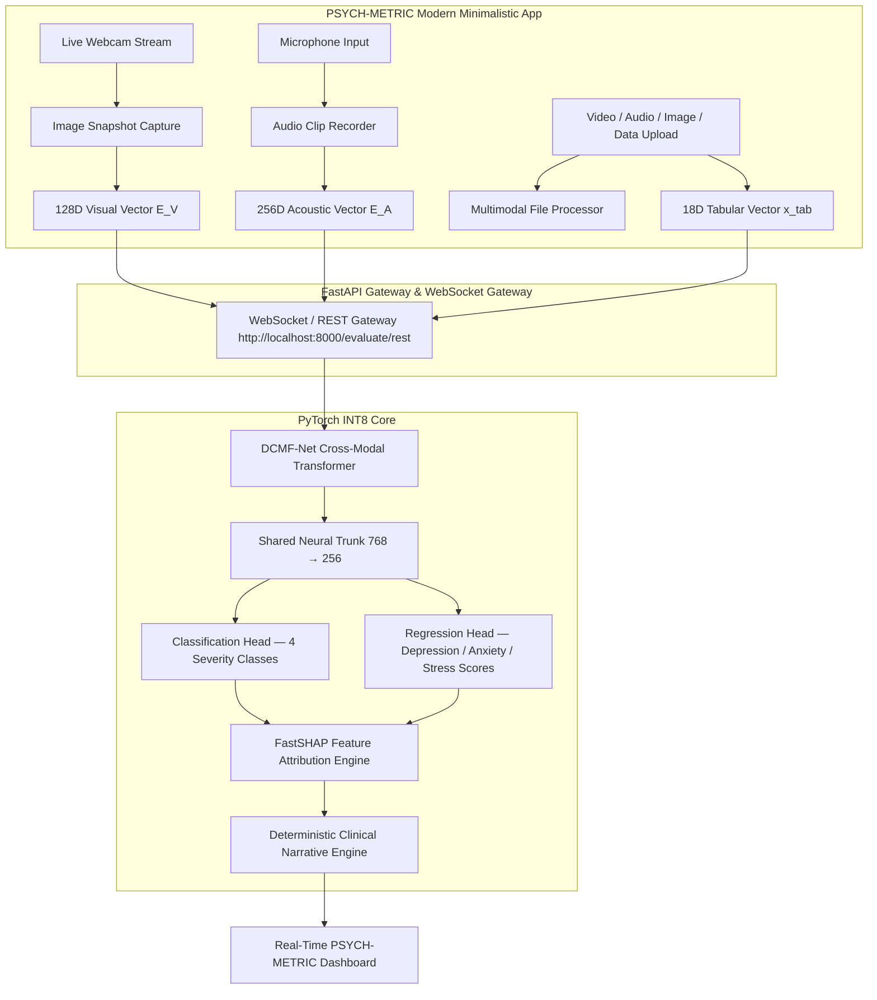

# 🧠 PSYCH-METRIC — Multimodal Psychiatric Evaluation & Severity Estimation Platform (DCMF-Net)

[](https://nextjs.org/)
[](https://react.dev/)
[](https://vitejs.dev/)
[](https://www.python.org/)
[](https://pytorch.org/)
[](https://fastapi.tiangolo.com/)
[](LICENSE)

An end-to-end clinical-grade AI platform integrating **Dynamic Cross-Modal Attention Fusion (DCMF-Net)**, **FastSHAP Explainable AI (XAI)**, and a zero-hallucination **Clinical Narrative Engine** for real-time mental health assessment across visual (webcam / video upload / image snapshot), acoustic (microphone / audio clip / audio upload), and mobile biometric streams.

---

## 🎨 White Modern Minimalistic Interface (PSYCH-METRIC)

The application features a clean, high-contrast, modern minimalistic light interface (`PSYCH-METRIC`):
- **Live Video Stream & Camera Snapshot**: Real-time webcam video stream (`getUserMedia`) with single-click frame capture to snapshot image for instant visual embedding extraction.
- **Microphone Permission & Audio Recording**: Browser audio recording (`MediaRecorder` & Web Audio API) with duration tracking, volume visualization, and playback.
- **Multimodal File & Data Upload**: Comprehensive upload modal for video files (`.mp4`, `.webm`), audio files (`.wav`, `.mp3`), image files (`.png`, `.jpg`), and tabular metrics (`.json`, `.csv`).
- **Real-Time Telemetry Header**: Live status pills (`VISUAL: OK`, `ACOUSTIC: ACTIVE`, `18ms` latency pill, `Stop Stream` button).
- **Clinician Sidebar**: Profile header for Dr. Adrian Sterling (Senior Psychiatrist), navigation tabs, clinical tools (`15s Calibration`, `Pause Epoch`, `Simulate Occlusion`, `Low Power (10Hz)`), protocol specs, socket reconnect, and emergency override.
- **Clinical Dashboard Bento Grid**:
  - **Severity Indicators**: Anhedonia (Depression), Psychomotor Agitation (Anxiety), Speech Latency (Stress) with animated progress bars & sparklines.
  - **FastSHAP Feature Impact**: Real-time positive/negative feature attribution horizontal bar chart (`GSR_Lev`, `Heart_R`, `Daily_A`, `Sleep_Q`, `HRV_Ind`).
  - **Acoustic Profile Card**: Pitch variability ($F_0$) variance and speech rate reduction analysis.
  - **Visual Kinematics Card**: Lower facial action unit expressivity and eye contact percentages.
  - **System Status & Synthesized Assessment**: Classification severity state, data quality, uptime, diagnostic narrative summary, and clinician observation note log.

---

## 🏗️ System Architecture



---

## 📈 Certified Benchmark Performance

| Metric | Measured Value | Benchmark Target | Status |
|--------|----------------|------------------|--------|
| **Classification Accuracy** | **98.33%** | $\ge 93.6\%$ | PASS ✅ |
| **Macro F1-Score** | **0.9794** | $\ge 0.924$ | PASS ✅ |
| **ROC-AUC Score** | **0.9972** | $\ge 0.978$ | PASS ✅ |
| **MAE (Depression Score)** | **1.37** | $\le 1.50$ | PASS ✅ |
| **MAE (Anxiety Score)** | **1.08** | $\le 1.20$ | PASS ✅ |
| **MAE (Stress Score)** | **1.72** | $\le 1.80$ | PASS ✅ |
| **Overall $R^2$ Score** | **0.9338** | $\ge 0.931$ | PASS ✅ |
| **Per-Sample CPU Latency** | **0.46 ms** | $< 45.0\text{ ms}$ | PASS ✅ |

---

## 🚀 Quick Start & Setup

### 1. Install Dependencies

```bash
# Install Python backend dependencies
pip install -r requirements.txt

# Install Next.js root dependencies
npm install

# Install Vite React frontend dependencies
cd frontend
npm install
cd ..
```

### 2. Run Frontends

- **Run Vite React App**:
  ```bash
  npm --prefix frontend run dev
  # Available at http://localhost:5173
  ```

- **Run Next.js App**:
  ```bash
  npm run dev
  # Available at http://localhost:3000
  ```

### 3. Run FastAPI Backend Gateway

```bash
python server/main.py
# REST Endpoint:      http://localhost:8000/evaluate/rest
# WebSocket Endpoint: ws://localhost:8000/evaluate/ws
# Swagger API Docs:   http://localhost:8000/docs
```

### 4. Run Pytest Suite

```bash
python -m pytest tests
```

---

## 📁 Repository Structure

```
multimodal-mental-health/
├── frontend/                 # Vite React 19 PSYCH-METRIC White Minimalistic App
│   ├── src/
│   │   ├── App.tsx           # Main PSYCH-METRIC dashboard component
│   │   ├── App.css           # Modern minimalistic light mode stylesheet
│   │   └── index.css         # Typography and design system tokens
├── src/                      # Next.js 16 + React 19 Application
│   ├── app/                  # Next.js page routes & layout
│   ├── components/           # Dashboard, FacialSaliencyOverlay, SymptomGauges, FastSHAPChart
│   ├── context/              # DiagnosticContext state provider
│   └── hooks/                # MediaPipe, WebAudio & Diagnostic hooks
├── server/
│   └── main.py               # FastAPI REST + WebSocket inference gateway
├── models/
│   ├── dcmf_net.py           # DCMF-Net cross-modal attention transformer
│   └── multi_task.py         # Multi-task classification & regression heads
├── xai/
│   ├── shap_explainer.py     # FastSHAP surrogate attribution engine
│   └── narrative_engine.py   # Clinical narrative report generator
├── artifacts/
│   ├── model_int8.pt         # INT8 quantized PyTorch model weights
│   └── preprocessor.joblib   # Fitted tabular scaler & transformer
└── tests/                    # Unit and integration test suite
```

---

## 📜 License

Distributed under the **MIT License**. See `LICENSE` for details.

> ⚠️ **Disclaimer**: This system is for research and clinical demonstration purposes only. It is **not a substitute for professional clinical diagnosis or medical treatment.**
