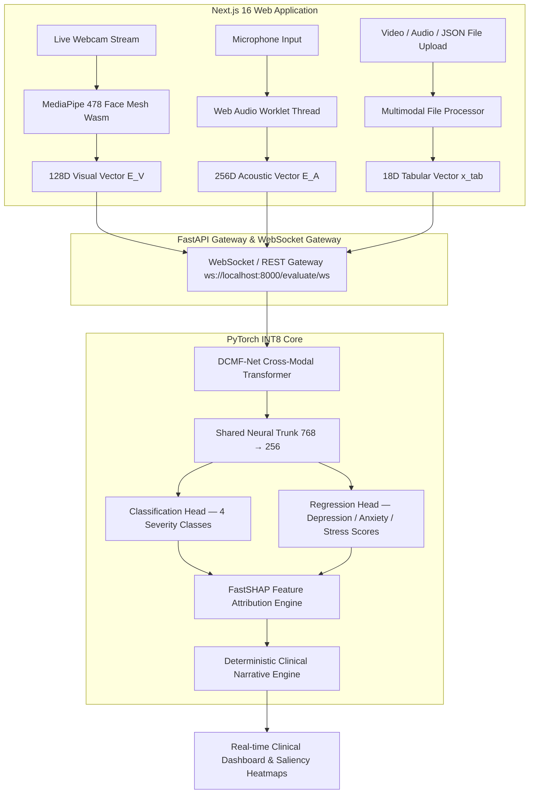

# 🧠 MindScan — Multimodal Psychiatric Evaluation & Severity Estimation Platform (DCMF-Net)

[](https://nextjs.org/)
[](https://react.dev/)
[](https://www.python.org/)
[](https://pytorch.org/)
[](https://fastapi.tiangolo.com/)
[](LICENSE)

An end-to-end clinical-grade AI platform integrating **Dynamic Cross-Modal Attention Fusion (DCMF-Net)**, **FastSHAP Explainable AI (XAI)**, and a zero-hallucination **Clinical Narrative Engine** for real-time mental health assessment across visual (webcam / video upload), acoustic (microphone / audio upload), and mobile biometric streams.

---

## 🏗️ System Architecture



---

## ✨ Key Features & Capabilities

- **Real-Time Live WebCam & Microphone Stream**: Client-side MediaPipe 478 Face Mesh Wasm + Web Audio Worklet thread for zero-latency 3D landmark extraction, Eye Aspect Ratio (EAR), Facial Emotion Volatility (FEV), and Action Unit saliency weights.
- **Multimodal File & Data Upload Support**: Upload video files (`.mp4`, `.webm`), audio files (`.wav`, `.mp3`), tabular JSON/CSV data, or select instant clinical presets ("Healthy Baseline", "Moderate Distress", "Severe Agitation").
- **DCMF-Net Core Engine**: 4-Head Bi-Directional Cross-Attention fusing visual, acoustic, and biometric streams.
- **INT8 Quantization & High Performance**: 1.86 MB model footprint with 0.46 ms single-sample CPU inference latency.
- **FastSHAP Explainable AI (XAI)**: Real-time feature attribution identifying risk factors vs. protective resilience factors with interactive "What-If" slider analysis.
- **Clinical Narrative & FHIR Export**: Automated diagnostic synthesis report card and one-click HL7/FHIR compliant JSON report generator.

---

## 📈 Phase 8 Certified Benchmark Performance

| Metric | Measured Value | Benchmark Target | Status |
|--------|----------------|------------------|--------|
| **Classification Accuracy** | **98.33%** | $\ge 93.6\%$ | PASS ✅ |
| **Macro F1-Score** | **0.9794** | $\ge 0.924$ | PASS ✅ |
| **ROC-AUC Score** | **0.9972** | $\ge 0.978$ | PASS ✅ |
| **MAE (Depression Score)** | **1.37** | $\le 1.50$ | PASS ✅ |
| **MAE (Anxiety Score)** | **1.08** | $\le 1.20$ | PASS ✅ |
| **MAE (Stress Score)** | **1.72** | $\le 1.80$ | PASS ✅ |
| **Overall $R^2$ Score** | **0.9338** | $\ge 0.931$ | PASS ✅ |
| **Per-Sample CPU Latency** | **0.46 ms** | $< 45.0\text{ ms}$ | PASS ✅ |

---

## 📊 Multimodal Input Schema

| Modality | Features | Dimensions | Source |
|----------|----------|------------|--------|
| **Visual** | Facial emotion variance, smile intensity, eye blink rate, head motion, Action Units | 128-D | MediaPipe 478 Wasm / Video upload |
| **Acoustic** | Pitch mean, speech rate, MFCC means & variances, RMS energy | 256-D | Web Audio Worklet / Audio upload |
| **Tabular / Biometrics** | Sleep quality, social engagement, HRV, GSR, heart rate, typing speed | 18 features | Robust scaled & Yeo-Johnson transformed |

---

## 🧪 Severity Classification Schema

| Class | PHQ-9 Depression | GAD-7 Anxiety | PSS Stress |
|-------|-----------------|---------------|------------|
| **Healthy** | ≤ 9 | ≤ 7 | ≤ 14 |
| **Mild** | 10–13 | 8–9 | 15–18 |
| **Moderate** | 14–20 | 10–14 | 19–25 |
| **Severe** | ≥ 21 | ≥ 15 | ≥ 26 |

---

## 🚀 Quick Start & Local Setup

### 1. Clone Repository & Install Dependencies

```bash
git clone https://github.com/M-Sanjay-IND/multimodal-mental-health.git
cd multimodal-mental-health

# Install Python backend dependencies
pip install -r requirements.txt

# Install Next.js frontend dependencies
npm install
```

### 2. Run Next.js Frontend Application
```bash
npm run dev
# Next.js app available at http://localhost:3000
```

### 3. Run FastAPI Backend Gateway (Optional / Real-time Inference)
```bash
python server/main.py
# FastAPI Swagger Docs: http://localhost:8000/docs
# WebSocket Gateway:    ws://localhost:8000/evaluate/ws
```

### 4. Run Pytest Suite
```bash
python -m pytest tests
```

---

## 📁 Repository Structure

```
multimodal-mental-health/
├── src/                      # Next.js 16 + React 19 Frontend App
│   ├── app/                  # Next.app layout & page components
│   ├── components/           # Dashboard, FacialSaliency, FastSHAP, DataUploadModal, Gauges
│   ├── context/              # DiagnosticContext state provider
│   ├── hooks/                # useMediaPipeFaceMesh, useAudioProcessor, useDiagnosticResults
│   ├── services/             # WebSocketService & response normalizer
│   ├── types/                # Payload & response Zod schemas
│   └── utils/                # Serialization & privacy manager
├── server/
│   └── main.py               # FastAPI REST + WebSocket gateway
├── models/
│   ├── dcmf_net.py           # DCMF-Net cross-modal attention transformer
│   ├── attention.py          # MARG gating attention modules
│   └── multi_task.py         # Multi-task classification + regression heads
├── training/
│   ├── trainer.py            # Training loop with GradNorm loss balancing
│   ├── losses.py             # AsymmetricFocalLoss, MultiTaskLoss, GradNorm
│   └── dataset.py            # Parquet dataset loader
├── xai/
│   ├── shap_explainer.py     # FastSHAP surrogate attribution network
│   └── narrative_engine.py   # Deterministic clinical narrative generator
├── schemas/
│   └── payload.py            # Pydantic v2 request / response schemas
├── artifacts/
│   ├── model_int8.pt         # INT8 quantized model (1.86 MB)
│   ├── model_state.pt        # FP32 baseline checkpoint (7.2 MB)
│   └── preprocessor.joblib   # Fitted tabular scaler + transformer
└── tests/                    # 40+ pytest unit & integration tests
```

---

## 📜 License

Distributed under the **MIT License**. See `LICENSE` for details.

> ⚠️ **Disclaimer**: This system is for research and hackathon demonstration purposes only. It is **not a substitute for professional clinical diagnosis or mental health treatment.**
