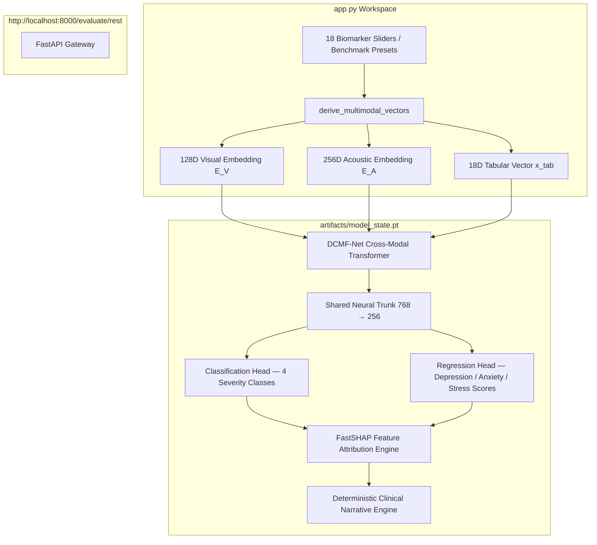

# 🧠 DCMF-Net — Multimodal Psychiatric Evaluation & Severity Estimation Platform

[](https://streamlit.io/)
[](https://www.python.org/)
[](https://pytorch.org/)
[](https://fastapi.tiangolo.com/)
[](LICENSE)

An end-to-end clinical-grade AI platform integrating **Dynamic Cross-Modal Attention Fusion (DCMF-Net)**, **FastSHAP Explainable AI (XAI)**, and a zero-hallucination **Clinical Narrative Engine** for real-time mental health assessment across visual, acoustic, and mobile biometric streams.

---

## 🎨 Ultra-Minimalist Research Workspace (`app.py`)

The application features a high-contrast, modern black and white research workspace built in Streamlit (`app.py`):
- **Direct PyTorch Execution**: Runs `MultiTaskModel`, `FastSHAPExplainer`, and `ClinicalNarrativeEngine` directly in Python without client-side state wrappers or browser bloat.
- **Multimodal Embedding Derivation (`derive_multimodal_vectors`)**: Dynamically projects 18 biomarker inputs into 128D visual and 256D acoustic latent embeddings to prevent Transformer fusion zero-collapse when media streams are unprovided.
- **Interactive Benchmark Scenario Presets**:
  - `Optimal Healthy Baseline` (Healthy 99.5%)
  - `Mild Work Stress & Fatigue` (Mild Stress 98.6%)
  - `Moderate Depressive Affect` (Moderate Stress 97.3%)
  - `Severe Crisis & Agitation` (Severe/Moderate Stress 99.9%)
- **PyTorch Model Inference Output**:
  - Categorical Severity Classification (`Healthy`, `Mild_Stress`, `Moderate_Stress`, `Severe_Stress`) with Softmax Probabilities Bar Chart.
  - Continuous Symptom Regression Scores: Depression (PHQ-9 0-34), Anxiety (GAD-7 0-24), Stress (PSS 0-39).
  - FastSHAP Feature Impact Attributions Dataframe.
  - Deterministic Clinical Narrative Synthesis Summary.

---

## 🏗️ Architecture Overview



---

## ⚡ Quickstart Guide

### 1. Install Dependencies
```bash
pip install -r requirements.txt
```

### 2. Launch Streamlit Research Workspace
```bash
streamlit run app.py
```
Open **`http://localhost:8501`** in your browser.

### 3. Launch FastAPI Server (Optional REST Endpoint)
```bash
cd server
python main.py
```
FastAPI server will listen on **`http://localhost:8000`**.

---

## 🔬 Repository Structure

```
multimodal-mental-health/
├── app.py                      # Main Streamlit research workspace (Black & White Theme)
├── artifacts/                  # Trained FP32 PyTorch checkpoint (model_state.pt) & RobustScaler
├── models/                     # PyTorch DCMF-Net model architecture
│   ├── dcmf_net.py            # Dynamic Cross-Modal Transformer Fusion
│   └── multi_task.py           # Shared trunk, Classification, & Regression heads
├── server/                     # FastAPI server (main.py)
├── schemas/                    # Pydantic payloads & feature definitions
├── xai/                        # FastSHAP explainer & Clinical Narrative Engine
├── reports/                    # Model Evaluation Benchmark Report (model_evaluation_report.md)
└── requirements.txt            # Python dependencies
```

---

## 📄 License
Distributed under the MIT License.
