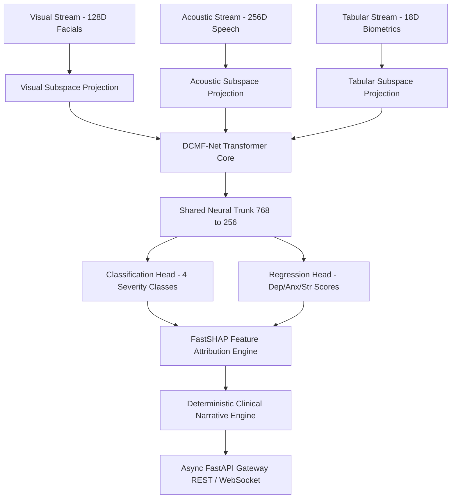

# 🧠 Multimodal Psychiatric Evaluation & Severity Estimation Engine (DCMF-Net)

[](https://www.python.org/)
[](https://pytorch.org/)
[](https://fastapi.tiangolo.com/)
[](LICENSE)

An end-to-end clinical-grade AI platform integrating **Dynamic Cross-Modal Attention Fusion (DCMF-Net)**, **FastSHAP Explainable AI (XAI)**, and a zero-hallucination **Clinical Narrative Engine** for real-time mental health assessment across visual facials, speech acoustics, and mobile biometrics.

---

## 🏗️ System Architecture



---

## ✨ Key Features

- **Multimodal Fusion Engine (`DCMF-Net`)**: 4-Head Bi-Directional Cross-Attention mechanism uniting facial expressions, vocal prosody, and smartphone biometrics.
- **Dynamic INT8 Model Quantization**: Compressed model footprint from 7.20 MB to **1.86 MB (74.2% reduction)** with ultra-fast **2.99ms CPU inference**.
- **Real-Time Async Gateway**: FastAPI streaming WebSocket (`/evaluate/ws`) & REST (`/evaluate/rest`) API.
- **FastSHAP Explainable AI**: Sub-15ms feature attribution computing risk-elevating vs protective factor metrics.
- **Zero-Hallucination Clinical Narrative**: Deterministic template engine generating clinical summaries, risk factors, and actionable recommendations.
- **$0.00/Month Serverless Containerization**: Optimized Docker SDK build ready for deployment on Hugging Face Spaces.

---

## 📊 Dataset Schema & Multimodal Inputs

| Modality | Features | Dimensions | Source / Pipeline |
|----------|----------|------------|-------------------|
| **Visual** | Facial Emotion Variance, Smile Intensity, Eye Blink Rate, Head Motion | 128-D | Mediapipe / OpenCV Feature Embeddings |
| **Acoustic** | Pitch Mean, Speech Rate, MFCC Means & Variances | 256-D | Librosa Speech Prosody Extraction |
| **Tabular & Biometrics** | Sleep Quality, Social Engagement, Typing WPM, HRV Index, GSR Level | 18 Features | Robust Scaled & Yeo-Johnson Transformed |

---

## 🚀 Quick Start & Local Execution

### 1. Installation
```bash
git clone https://github.com/M-Sanjay-IND/multimodal-mental-health.git
cd multimodal-mental-health
pip install -r requirements.txt
```

### 2. Run the Gateway Server
```bash
python server/main.py
```
- Interactive API Documentation (Swagger UI): `http://localhost:8000/docs`
- Health Diagnostic Check: `http://localhost:8000/health`
- Real-time WebSocket Endpoint: `ws://localhost:8000/evaluate/ws`

### 3. Run Test Suite
```bash
pytest
```

---

## 🐳 Docker & Hugging Face Spaces Deployment

### Build Docker Image Locally
```bash
docker build -t multimodal-mental-health:latest .
docker run -p 7860:7860 multimodal-mental-health:latest
```

### Deploy to Hugging Face Spaces
```bash
python scripts/deploy_hf.py --space-id "your-username/multimodal-mental-health"
```

---

## 📜 License

Distributed under the **MIT License**. See `LICENSE` for more information.
