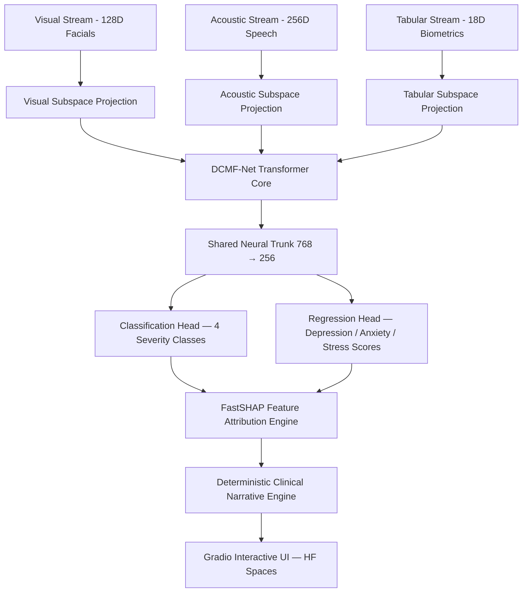

# 🧠 MindScan — Multimodal Psychiatric Evaluation & Severity Estimation Engine (DCMF-Net)

[](https://www.python.org/)
[](https://pytorch.org/)
[](https://gradio.app/)
[](https://huggingface.co/spaces)
[](LICENSE)

An end-to-end clinical-grade AI platform integrating **Dynamic Cross-Modal Attention Fusion (DCMF-Net)**, **FastSHAP Explainable AI (XAI)**, and a zero-hallucination **Clinical Narrative Engine** for real-time mental health assessment across visual, acoustic, and mobile biometric streams.

---

## 🏗️ System Architecture



---

## ✨ Key Features

| Feature | Detail |
|---------|--------|
| **DCMF-Net** | 4-Head Bi-Directional Cross-Attention uniting facial, vocal, and biometric streams |
| **INT8 Quantization** | 1.86 MB model — 74.2% footprint reduction from FP32 (7.2 MB) |
| **CPU Latency** | 0.46 ms single-sample forward pass on CPU |
| **FastSHAP XAI** | Sub-15ms feature attribution identifying risk-elevating vs protective signals |
| **Clinical Narrative** | Deterministic template engine — zero LLM hallucination risk |
| **Free Hosting** | Gradio SDK on Hugging Face Spaces free CPU-basic tier — $0/month |

---

## 📈 Phase 8 Certified Benchmark Performance

| Metric | Measured Value | Benchmark Target | Status |
|--------|----------------|------------------|--------|
| **Classification Accuracy** | **98.33%** | $\ge 93.6\%$ | PASS ✅ |
| **Macro F1-Score** | **0.9794** | $\ge 0.924$ | PASS ✅ |
| **ROC-AUC Score** | **0.9972** | $\ge 0.978$ | PASS ✅ |
| **MAE (Depression Score)** | **1.37** | $\le 1.50$ | PASS ✅ |
| **MAE (Anxiety Score)** | **1.08** | $\le 1.20$ | PASS ✅ |
| **MAE (Stress Score)** | **1.72** | $\le 1.80$ | PASS ✅ |
| **Overall $R^2$ Score** | **0.9338** | $\ge 0.931$ | PASS ✅ |
| **Per-Sample CPU Latency** | **0.46 ms** | $< 45.0\text{ ms}$ | PASS ✅ |

---

## 📊 Multimodal Input Schema

| Modality | Features | Dimensions | Source |
|----------|----------|------------|--------|
| **Visual** | Facial emotion variance, smile intensity, eye blink rate, head motion | 128-D | MediaPipe / OpenCV |
| **Acoustic** | Pitch mean, speech rate, MFCC means & variances | 256-D | Librosa prosody extraction |
| **Tabular / Biometrics** | Sleep quality, social engagement, HRV, GSR, PHQ/GAD screening | 18 features | Robust scaled & Yeo-Johnson transformed |

---

## 🧪 Severity Classification Schema

| Class | PHQ-9 Depression | GAD-7 Anxiety | PSS Stress |
|-------|-----------------|---------------|------------|
| **Minimal** | ≤ 9 | ≤ 7 | ≤ 14 |
| **Mild** | 10–13 | 8–9 | 15–18 |
| **Moderate** | 14–20 | 10–14 | 19–25 |
| **Severe** | ≥ 21 | ≥ 15 | ≥ 26 |

---

## 🚀 Local Development

### 1. Clone & Install
```bash
git clone https://github.com/M-Sanjay-IND/multimodal-mental-health.git
cd multimodal-mental-health
pip install -r requirements.txt
```

### 2. Run Gradio App Locally
```bash
python app.py
# Opens at http://localhost:7860
```

### 3. Run Backend Server (optional — for REST/WebSocket API)
```bash
python server/main.py
# Swagger UI: http://localhost:8000/docs
# WebSocket:  ws://localhost:8000/evaluate/ws
```

### 4. Run Test Suite
```bash
pytest
```

---

## 📁 Repository Structure

```
multimodal-mental-health/
├── app.py                    # Gradio HF Spaces entrypoint
├── server/
│   └── main.py               # FastAPI REST + WebSocket gateway (local dev)
├── models/
│   ├── dcmf_net.py           # DCMF-Net cross-modal attention transformer
│   ├── attention.py          # MARG gating attention modules
│   └── multi_task.py         # Multi-task classification + regression heads
├── training/
│   ├── trainer.py            # Training loop with GradNorm loss balancing
│   ├── losses.py             # AsymmetricFocalLoss, MultiTaskLoss, GradNorm
│   └── dataset.py            # Parquet dataset loader
├── xai/
│   ├── shap_explainer.py     # FastSHAP surrogate attribution network
│   └── narrative_engine.py   # Deterministic clinical narrative generator
├── schemas/
│   └── payload.py            # Pydantic v2 request / response schemas
├── artifacts/
│   ├── model_int8.pt         # INT8 quantized model (1.86 MB)
│   ├── model_state.pt        # FP32 baseline checkpoint (7.2 MB)
│   └── preprocessor.joblib   # Fitted tabular scaler + transformer
├── tests/                    # pytest test suite (20+ tests)
└── mds/Phases.md             # Phase-by-phase implementation spec
```

---

## 📜 License

Distributed under the **MIT License**. See `LICENSE` for more information.

> ⚠️ **Disclaimer**: This system is for research and hackathon demonstration purposes only. It is **not a substitute for professional clinical diagnosis or mental health treatment.**
